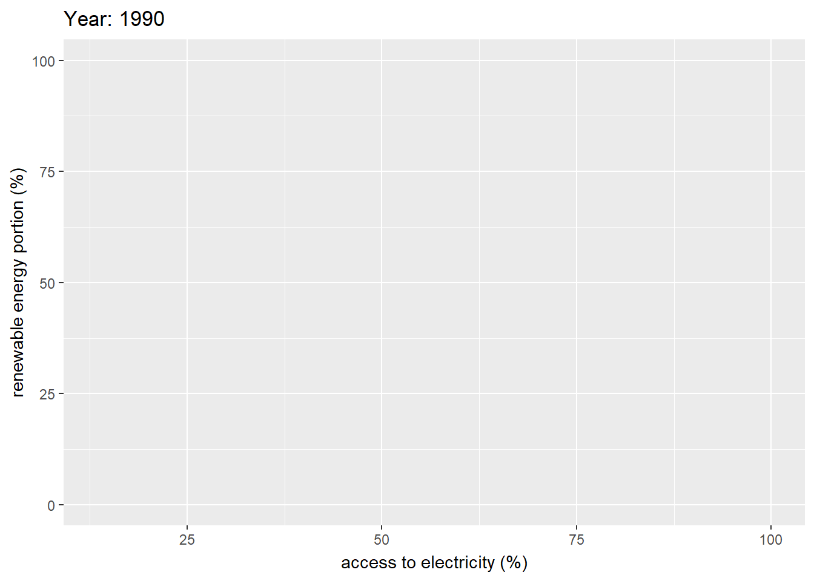

```{r packages, message=FALSE, warning=FALSE, echo=FALSE}
library(tidyverse)
library(tidymodels) #Interesting collections of models.
library(ggtext) #similar to ggplot but for text.
library(knitr)
library(kableExtra) 
library(janitor)
```


---

## Import Data: Energy & Mining


```{r, echo=FALSE, message=FALSE, include=FALSE, warning=FALSE}

energy <- read_csv("energy-and-mining.csv", na = c("n/a", "", "NA")) %>%
  janitor::clean_names() %>%
filter(country_name =="China" |
         country_name =="India" |
         country_name =="United States" |
         country_name =="Indonesia" |
         country_name =="Pakistan" |
         country_name =="Brazil" |
         country_name =="Nigeria" |
         country_name =="Bangladesh" |
         country_name =="Russia" |
         country_name =="Japan") %>%
  
mutate(access_to_electricity_percent_of_population=replace(access_to_electricity_percent_of_population, access_to_electricity_percent_of_population > 100, NA)) %>%
mutate(renewable_energy_consumption_percent_of_total_final_energy_consumption=replace(renewable_energy_consumption_percent_of_total_final_energy_consumption, renewable_energy_consumption_percent_of_total_final_energy_consumption > 100, NA))


# rename(access_to_electricity_percent_of_population = access_to_electricity_percent_of_population) 
  
 

names(energy)
```

This post consists of exploratory analysis of a dataset provided by the world bank. It includes `r ncol(energy)` variable and `r nrow(energy)` observations that represent many countries around the world between 1960 to 2017. Variables include varieties of parameters related to welfare and sustainability in examined countries. These variables include but not limited to access and consumption of different types of energies from different sources.

This dataset could be find in the below link:

(https://github.com/ZeningQu/World-Bank-Data-by-Indicators/blob/master/engergy-and-mining/energy-and-mining.csv)

## Initial Analysis Questions

## Initial Analysis Questions


```{r, echo=FALSE, warning=FALSE}
energy %>%
  ggplot(aes(access_to_electricity_percent_of_population, renewable_energy_consumption_percent_of_total_final_energy_consumption, color=country_name))+ geom_point()
#+geom_smooth(method = "lm")
  
```


```{r, warning=FALSE, echo=FALSE}
energy%>%
  
mutate(pump_price_for_diesel_fuel_us_per_liter=replace(pump_price_for_diesel_fuel_us_per_liter, pump_price_for_diesel_fuel_us_per_liter == 00, NA)) %>% 
  ggplot(aes(year, pump_price_for_diesel_fuel_us_per_liter, color=country_name))+ geom_point()+geom_smooth(method = "lm",se=FALSE)+
  xlim(1990, 2010)+ylim(0, 1.1)
  
```


# Initial Analysis Questions

1. 


## captioned visualizations that convey key insights gained during your analysis


```{r, echo=FALSE, warning=FALSE, message=FALSE}
library(gganimate)


energy2 <- read_csv("energy-and-mining.csv", na = c("n/a", "", "NA")) %>%
  janitor::clean_names() %>%
  filter(between(year,1990,2017)) %>%
filter(country_name =="China" |
         country_name =="India" |
         country_name =="United States" |
         country_name =="Indonesia" |
         country_name =="Pakistan" |
         country_name =="Brazil" |
         country_name =="Nigeria" |
         country_name =="Bangladesh" |
         country_name =="Russia" |
         country_name =="Japan"|
         country_name =="Iran, Islamic Rep."|
         country_name =="Mexico" |
         country_name =="Germany" |
         country_name =="New Zealand" |
         country_name =="Sweden" |
         country_name =="Turkey" |
         country_name =="Argentina" |
         country_name =="Singapore") %>%
  
mutate(access_to_electricity_percent_of_population=replace(access_to_electricity_percent_of_population, access_to_electricity_percent_of_population > 100, NA)) %>%
mutate(renewable_energy_consumption_percent_of_total_final_energy_consumption=replace(renewable_energy_consumption_percent_of_total_final_energy_consumption, renewable_energy_consumption_percent_of_total_final_energy_consumption > 100, NA))


 
 
 energy2 %>%
  
  ggplot(aes(access_to_electricity_percent_of_population, renewable_energy_consumption_percent_of_total_final_energy_consumption, color=country_name))+
  geom_point(size=4)+
   
   
   labs(
        x = 'access to electricity (%)',
        y = 'renewable energy portion') +
  transition_time(year) +
  ease_aes('linear')

# Save at gif:
anim_save("1.gif")

```

```{r out.width="98%", echo=FALSE, warning=FALSE}
#
```